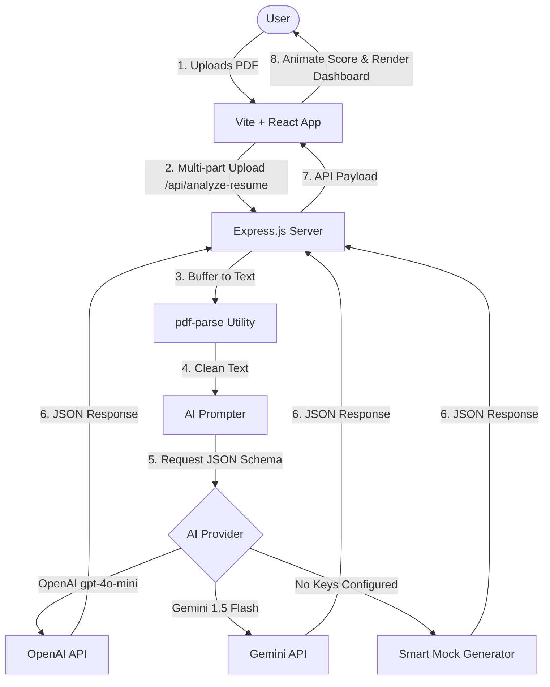

# Technical Stack & Architecture

This document details the architectural decisions and technology stack used to build the **AI Resume Analyzer**.

---

## Architecture Flow Chart

---

## Detailed Tech Stack & Reasoning

### 1. Frontend

- **React & Vite**: Selected for rapid start times, efficient Hot Module Replacement (HMR), and solid state management. It provides a standard structure without the overhead/cold start times of Next.js for single-page applications.
- **Custom CSS (Vanilla)**: Standard vanilla CSS is utilized over styling utilities to deliver a bespoke, modern look containing neon backdrops, glassmorphism, responsive grids, and keyframe animations for score increments.
- **Lucide React**: Offers an exhaustive catalog of clean, vector-based SVG icons matching modern design guides.

### 2. Backend

- **Node.js & Express**: Provides a robust, lightweight foundation for running custom middleware (like Multer) and handling cross-origin requests.
- **Multer**: Configured with a `memoryStorage` engine to capture uploaded file streams directly as raw buffers. This prevents disk read/write cycles, removing cleanup management overhead and securing temporary file privacy.
- **pdf-parse**: Evaluates the PDF buffer and pulls out textual nodes. It performs fast parsing directly in-memory and supports standard PDF specification types.
- **dotenv**: Restricts local secrets to `.env` variables, preventing the checking of API keys into version control.

### 3. AI & Prompt Engineering

- **Structured JSON Mode**: The analysis query demands strict JSON schema conformity from both OpenAI and Gemini models. By using OpenAI's `response_format: { type: "json_object" }` and Gemini's `responseMimeType: "application/json"`, we guarantee the response can be safely parsed by `JSON.parse` in JavaScript.
- **System Prompt Specification**: Directs the LLM to inspect the resume against applicant tracking systems and deliver a score, executive summary, strengths, weaknesses, and improvement lists.
- **Smart Fallback Engine**: If environment variables are missing, the backend triggers local scanning of keywords (e.g. looking for Python, React, SQL, Jest) and builds custom mock reports. This ensures immediate usability on first clone.
